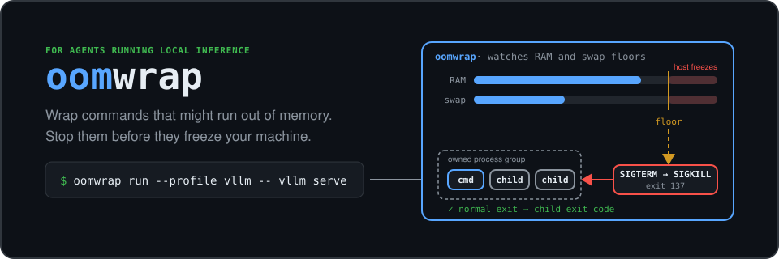

# oomwrap

<p align="center">
  
</p>

oomwrap is a Linux command-line tool for process-scoped memory protection. It
checks available RAM and swap before it starts one command, then stops that
command's process group if either configured floor is crossed.

Use it for any local workload that can exhaust memory, such as a large build,
renderer, data conversion, model load, or inference server. oomwrap complements
machine-wide tools such as `earlyoom`; it does not replace them.

## Install

Install oomwrap from GitHub:

```bash
cargo install --git https://github.com/osolmaz/oomwrap --locked
```

For development from a local checkout:

```bash
cargo install --path . --locked
```

Check the machine and installation:

```bash
oomwrap doctor
oomwrap inspect
```

## Run a command

Choose RAM and swap floors for the machine and workload:

```bash
oomwrap run \
  --profile generic \
  --min-mem 8G \
  --min-swap 1G \
  -- ./build-large-project.sh
```

oomwrap launches the child in its own process group. It forwards terminal
signals and returns the child exit code on a normal exit. If memory pressure
crosses a floor, oomwrap sends `SIGTERM`, waits for the configured grace period,
and then sends `SIGKILL` to the remaining process group. A pressure stop returns
exit code `137`.

## Inference example

Inference profiles recognize common local engines and require active `earlyoom`
by default:

```bash
oomwrap run \
  --profile sglang \
  --min-mem 24G \
  --min-swap 4G \
  -- python -m sglang.launch_server ...
```

Supported profiles are `auto`, `vllm`, `llama-cpp`, `sglang`, `trtllm`, `tgi`,
and `generic`. Use `generic` for other commands. Use `--allow-no-earlyoom` only
for tests or controlled machines with another machine-wide safety mechanism.

## Event logs

Write launch, refusal, exit, and memory-pressure events as JSON Lines:

```bash
oomwrap run \
  --event-log ./oomwrap.events.jsonl \
  --profile generic \
  --min-mem 8G \
  --min-swap 1G \
  -- ./memory-heavy-command
```

## Inference command wrappers

PATH shims let existing inference commands run through oomwrap without changes
to each script:

```bash
oomwrap install-shims
```

This installs shims for common inference tools under `~/.local/bin`. Put that
directory before the real runtime directory in `PATH`.

Remove the shims with:

```bash
oomwrap uninstall-shims
```

Use `wrap` when a benchmark or script calls a fixed runtime path:

```bash
oomwrap wrap ~/runtimes/vllm/current/.venv/bin/vllm
```

This moves the original executable to `vllm.real` and places an oomwrap-managed
wrapper at the original path. Restore it with:

```bash
oomwrap unwrap ~/runtimes/vllm/current/.venv/bin/vllm
```

## Exit behavior

- Child exits normally: return the child exit code.
- Required `earlyoom` is missing: return `3`.
- A preflight memory or swap floor fails: return `4`.
- oomwrap stops the group for memory pressure: return `137`.
- Configuration or supervision fails: return `2`.

## Agent skill

The canonical `memory-safe-launch` skill is in
[`.agents/skills/memory-safe-launch`](.agents/skills/memory-safe-launch). It
describes a safe launch procedure for general memory-heavy commands and adds
checks for local model inference.

The binary exposes the skill through
[Skillflag](https://github.com/osolmaz/skillflag):

```bash
oomwrap --skill list
oomwrap --skill show memory-safe-launch
oomwrap --skill export memory-safe-launch > memory-safe-launch.tar
```

The skill is embedded in the binary, so these commands also work after a
`cargo install` without the source checkout.

## License

[MIT](LICENSE)
